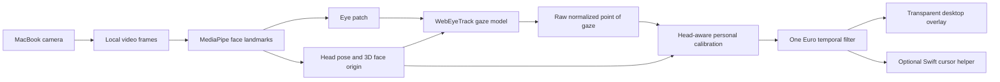

# GazeGlider

Local, webcam-based gaze control for Apple Silicon Macs. GazeGlider estimates where you are looking, corrects the estimate for head position and distance through a personal calibration, and moves either a visual overlay or the macOS pointer.

The webcam feed is processed on-device. GazeGlider does not upload camera frames, face landmarks, or calibration samples.

## Current capabilities

- Uses the MacBook camera with WebEyeTrack and MediaPipe face geometry.
- Tracks eye appearance together with head pitch, yaw, roll, position, face scale, and estimated `dZ` distance.
- Runs a 17-position screen calibration plus head-range samples and a 5-position accuracy check.
- Fits a robust, regularized, person-specific mapping to screen coordinates.
- Applies adaptive One Euro filtering to reduce jitter without making large gaze shifts excessively slow.
- Draws one of three click-through desktop elements: a glow orb, animated eyes, or a precision reticle.
- Optionally moves the actual macOS pointer through a small native Swift helper.
- Provides global safety shortcuts and never clicks automatically.

## System requirements

- Apple Silicon Mac (`arm64`), with a MacBook Pro built-in camera as the primary target.
- macOS 14 or newer.
- Node.js 22 or newer.
- Apple Command Line Tools for the native cursor helper:

```bash
xcode-select --install
```

## Run locally

```bash
git clone https://github.com/nikhi1g/gaze-glider.git && cd gaze-glider && npm install && npm run dev
```

During setup, GazeGlider downloads the upstream gaze and face-landmark model files, verifies the WebEyeTrack model files against their Git blob hashes, copies the MediaPipe WASM runtime into the local application, and patches WebEyeTrack to load those assets from the local server.

For a release build:

```bash
npm run dist:mac
```

The unsigned Apple Silicon DMG and ZIP are written to `release/`. After the repository is on GitHub, the manually triggered **Build macOS artifact** workflow performs the same unsigned ARM64 build and uploads it as a workflow artifact. macOS may require Control-clicking the app and selecting **Open** for the first launch. Production distribution should use an Apple Developer ID certificate, hardened runtime, and notarization.

## First-use procedure

1. In Control Center, turn **Center Stage off**. Dynamic camera cropping invalidates the calibrated camera geometry.
2. Place the laptop on a stable surface and use even front lighting.
3. Start the camera and wait for the local models to load.
4. Run calibration. Look at each point rather than moving your head to follow it.
5. During the center-position prompts, make the requested small head shifts. These samples let the correction model compensate for lateral position and `dZ` changes.
6. Start the desktop overlay.
7. Enable the system pointer only after the overlay behaves acceptably.

A saved calibration is scoped to the camera, display, display size, and Retina scale factor. Changing any of these requires recalibration.

## Safety controls

| Shortcut | Action |
|---|---|
| `⌘⇧G` | Toggle system-pointer control |
| `⌘⇧X` | Emergency stop: disable pointer control and hide the overlay |

GazeGlider intentionally has no blink click or dwell click. Looking at an item is not equivalent to intending to activate it. Use the trackpad, keyboard, switch input, or another explicit mechanism to confirm actions.

## Architecture



The calibration feature vector contains the raw gaze estimate, polynomial terms, head pitch/yaw/roll, reconstructed face origin, face scale, face center, and interaction terms. This is a hybrid approach: the pretrained model supplies a gaze estimate, while the local regression corrects systematic user-, camera-, screen-, and head-position-specific error.

See [docs/ARCHITECTURE.md](docs/ARCHITECTURE.md) for implementation details and [docs/ACCURACY.md](docs/ACCURACY.md) for measurement guidance.

## Repository layout

```text
src/                    Renderer UI, tracking, calibration, and filtering
electron/               Electron main process and isolated preload bridge
native/                 Swift/CoreGraphics cursor helper
scripts/                Asset installation, patching, development, and build tools
public/web/              Downloaded WebEyeTrack model assets, ignored by Git
public/mediapipe/        Downloaded face model and copied WASM runtime, ignored by Git
tests/                   Numerical and feature-extraction tests
docs/                    Architecture and accuracy notes
```

## Development commands

```bash
npm run setup       # install local model assets and compile the Swift helper
npm run dev         # Vite + Electron development mode
npm run check       # TypeScript, unit tests, and Node syntax checks
npm run build       # production web bundle + native helper
npm run package:mac # unpacked arm64 application
npm run dist:mac    # arm64 DMG and ZIP
```

## Known limitations

- A webcam is not equivalent to a dedicated infrared eye tracker. Expect coarse pointing and target snapping use cases, not pixel-perfect control.
- Accuracy degrades with glare, strong backlighting, glasses reflections, partial eyelid occlusion, rapid head motion, and positions outside the calibrated range.
- The current implementation targets one user and one selected display at a time.
- WebEyeTrack inference currently executes in the renderer process. The Electron renderer has background throttling disabled so tracking continues while the control window is occluded; a dedicated inference worker is a future optimization.
- The native helper is ad hoc signed for local development. Public distribution requires normal Apple code-signing and notarization work.
- This is an experimental interaction tool, not a medical device or certified accessibility product.

## Privacy model

Only static model files are downloaded. After setup, inference assets are served from a fixed, loopback-only origin on `127.0.0.1`. A single-instance lock keeps that origin stable so camera identity and saved calibration remain consistent between launches. Camera frames are converted to `ImageData` in the renderer, used for local inference, and discarded. Calibration coefficients are stored in the renderer's local storage. No analytics, telemetry, cloud API, or remote database is included.

## Upstream projects

GazeGlider builds on:

- [WebEyeTrack](https://github.com/RedForestAI/WebEyeTrack), MIT License.
- [MediaPipe Tasks Vision](https://github.com/google-ai-edge/mediapipe), Apache License 2.0.
- [TensorFlow.js](https://github.com/tensorflow/tfjs), Apache License 2.0, pulled transitively by WebEyeTrack.
- [Electron](https://github.com/electron/electron), MIT License.

See [THIRD_PARTY_NOTICES.md](THIRD_PARTY_NOTICES.md).

## License

MIT. See [LICENSE](LICENSE).
