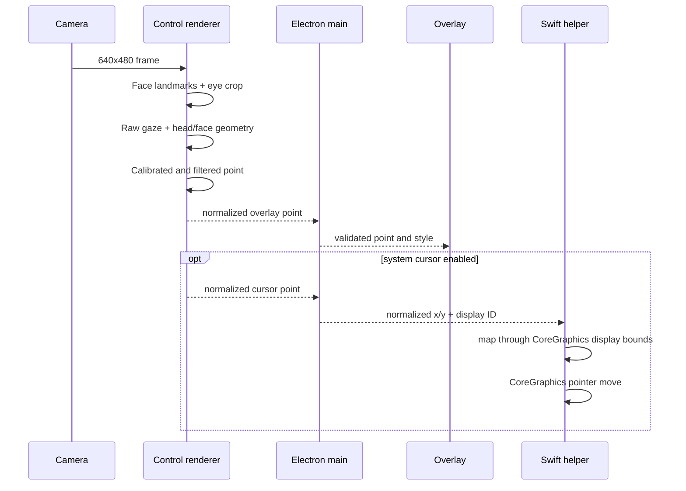

# GazeGlider Architecture

## Process topology

GazeGlider uses three local processes:

1. **Electron main process**: owns the application windows, display geometry, global shortcuts, Accessibility permission checks, and the native cursor-helper subprocess.
2. **Control renderer**: owns the webcam, WebEyeTrack inference, feature extraction, calibration, temporal filtering, and the control UI.
3. **Transparent overlay renderer**: draws the gaze element and full-screen calibration targets. It ignores mouse events and cannot activate underlying controls.

An optional fourth process, `GazeCursorHelper`, is compiled from Swift. It accepts a minimal newline-delimited JSON protocol for permission status, permission prompting, normalized pointer movement, and shutdown. It has no camera or model access and exposes no click command.

## Data flow

## Tracking pipeline

`WebEyeTrackerController` captures frames sequentially. A new frame is not processed while the previous inference call is active, which prevents unbounded work queues. Processing is limited to approximately 24 frames per second. The source video remains at a moderate resolution because gaze accuracy depends more on stable eye crops and calibration than on processing the full sensor resolution.

For each usable result, `FeatureExtractor` creates a 22-dimensional feature vector:

- Raw gaze `x` and `y`.
- Quadratic terms and `x*y`.
- Head yaw, pitch, and roll.
- Reconstructed face origin `x`, `y`, and `z`.
- Inter-eye face scale.
- Normalized face center.
- Gaze/head and gaze/depth interaction terms.

Closed-eye and invalid results are excluded from calibration and cursor movement.

## Calibration

The screen phase samples 17 positions, including corners, edges, central bands, and the center. The head-range phase collects center-gaze samples while the user remains neutral, moves slightly left and right, and changes distance. This gives the model local examples of the nuisance variables that otherwise shift the point of gaze.

The model standardizes each feature and fits two ridge regressions, one for screen `x` and one for screen `y`. The numerical system is solved by partial-pivot Gaussian elimination. A robust second fit rejects samples with residuals beyond a median-absolute-deviation threshold when enough samples remain.

A separate five-point pass reports median and 95th-percentile validation error in screen pixels. The validation data are not used to fit the model.

## Filtering

The WebEyeTrack model includes an internal Kalman filter. GazeGlider adds a final Two-dimensional One Euro filter after personal calibration. Its cutoff rises with movement speed:

- During fixation, low cutoff suppresses webcam and landmark jitter.
- During a saccade, higher cutoff allows the element to traverse the display quickly.

The filter is reset when displays, calibration, or tracking state change so old state cannot drag a new session.

## Window and IPC security

Both renderer windows use:

- `contextIsolation: true`
- `nodeIntegration: false`
- Electron sandboxing
- a narrow `contextBridge` API
- denied child windows
- blocked navigation away from the loopback application origin

The main process validates and clamps all coordinates received over IPC. The overlay is non-focusable, click-through, omitted from the Dock/task switcher, and shown only while calibration or tracking is active.

## Native cursor helper

Electron validates the normalized point and selected display ID, then sends both to the Swift helper. The helper maps the point through `CGDisplayBounds`, uses `CGWarpMouseCursorPosition`, and emits a `.mouseMoved` CoreGraphics event. The protocol also supports Accessibility status/prompt requests and shutdown; no click command exists.

The main process rate-limits helper updates and refuses to send them unless all of the following are true:

- Desktop tracking is active.
- Calibration is not running.
- System-cursor control is enabled.
- macOS reports Accessibility trust.
- The helper binary exists.

## Assets

`npm run setup` performs three asset operations:

1. Downloads the WebEyeTrack model JSON and weight shard and verifies their Git blob hashes.
2. Downloads the MediaPipe Face Landmarker task file and copies the installed Tasks Vision WASM runtime into `public/mediapipe/wasm`.
3. Patches the installed WebEyeTrack bundle's two remote MediaPipe URLs to local application paths.

The production renderer is served by a stable loopback HTTP origin because TensorFlow.js and MediaPipe load model and WASM files through URL-based APIs. A single-instance lock prevents two app processes from competing for that origin and preserves origin-scoped camera identity and calibration storage across launches.
